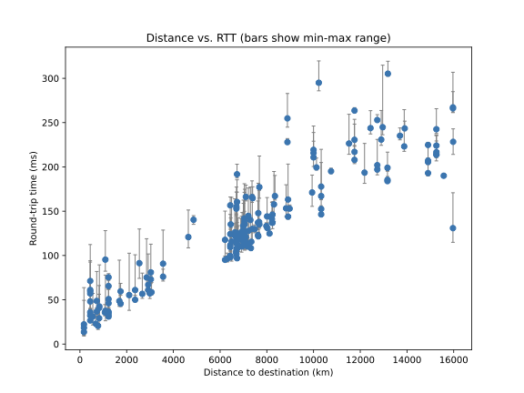
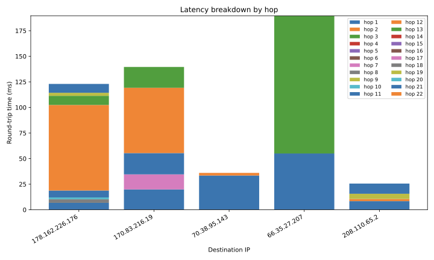
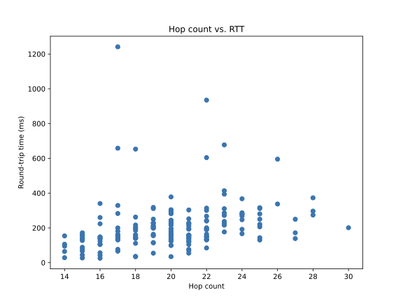

# Assignment 1 Report

*AI Acknowledgement*: We used Claude in this assignment to assist with code reviews, merge conflicts, as well as generating code on the function level.

Repo: https://github.com/CS422-Networks-Group/HW1 (branch [`submission`](https://github.com/CS422-Networks-Group/HW1/tree/submission))

## 1 (c) Does distance relate to RTT?

Yes, RTT (especially min RTT) correlates strongly with distance. Close servers (Chicago, Washington, Toronto, <1000 km) had min RTTs of 9-32 ms; far ones (Kediri, Floreal, ~15,000-16,000 km) had 213-261 ms.

Max RTT correlates much more weakly with distance, with several notable high outliers despite their associated min RTTs seeming "normal" relative to the distance. This likely means that congestion/queuing along the path is more relevant than distance for jitter. At almost the exact same distance (13,887 km), Auckland spiked to 99-101 ms of jitter between max and min RTT on both servers measured there, while Christchurch -- at that same distance -- showed almost none (4.9 ms).

*Generated by [`plot_distance_vs_rtt`](https://github.com/CS422-Networks-Group/HW1/blob/submission/src/visualize.py#L18-L39) in `src/visualize.py`, called from [`main()`](https://github.com/CS422-Networks-Group/HW1/blob/submission/src/main.py#L227-L296) in `src/main.py`.*

## 2 (d) Explain your observations from these plots. How does hop count relate to RTT?

Hop count barely predicts RTT at all. Three of our five destinations tied at 19 responsive hops (bwtest.linxtelecom.com, dfw.speedtest.is.cc, 189.25.101.151) still spread from 247 ms to 469 ms in total RTT, and the path with the *most* hops (a210.speedtest.wobcom.de, 24 hops) had the *lowest* RTT (186 ms) of all five. The stacked bar chart shows why: most hops -- the local network and the first couple of transit hops -- each add only a few ms, and total RTT is instead set by one or two slow hops later in the path. For example, on the path to 189.25.101.151, a single hop (62.216.131.29) adds 213 ms by itself -- nearly half of that path's entire 469 ms RTT. So RTT depends much more on which provider/backbone a path happens to cross than on how many hops it takes to get there.

*Generated by [`plot_latency_breakdown`](https://github.com/CS422-Networks-Group/HW1/blob/submission/src/visualize.py#L42-L69) and [`plot_hopcount_vs_rtt`](https://github.com/CS422-Networks-Group/HW1/blob/submission/src/visualize.py#L72-L83) in `src/visualize.py`, called from [`main()`](https://github.com/CS422-Networks-Group/HW1/blob/submission/src/main.py#L227-L296) in `src/main.py`.*

## References

Repo: https://github.com/CS422-Networks-Group/HW1 - all code below is on branch [`main`](https://github.com/CS422-Networks-Group/HW1/tree/main).

**Part 1 - ping + distance vs. RTT** ([`src/main.py`](https://github.com/CS422-Networks-Group/HW1/blob/submission/src/main.py)):
- [`process_csv`](https://github.com/CS422-Networks-Group/HW1/blob/submission/src/main.py#L41-L81) - resolves each target's location; drops rows whose host can't be resolved, and skips a host that resolves but has no entry in the IP2Location DB, instead of failing the whole run.
- [`execute_ping_tests`](https://github.com/CS422-Networks-Group/HW1/blob/submission/src/main.py#L84-L102) - corner case: if a target doesn't respond to `ping` (no RTT summary line), records `None` for that row rather than crashing.

**Part 2 - traceroute + latency breakdown** ([`src/main.py`](https://github.com/CS422-Networks-Group/HW1/blob/submission/src/main.py)):
- [`execute_traceroute_test`](https://github.com/CS422-Networks-Group/HW1/blob/submission/src/main.py#L104-L135) - corner case: reuses a cached `{raw_dir}/{ip}.txt` instead of re-running `traceroute`, and skips (rather than aborting the whole run) any host that times out or where `traceroute` exits non-zero.
- [`parse_traceroute_output`](https://github.com/CS422-Networks-Group/HW1/blob/submission/src/main.py#L137-L177) - corner case: filters out non-responsive hops (e.g. `* * *`) instead of treating them as zero-latency, and clamps negative hop-to-hop RTT deltas to 0.

**Entry point** ([`src/main.py`](https://github.com/CS422-Networks-Group/HW1/blob/submission/src/main.py)):
- [`main`](https://github.com/CS422-Networks-Group/HW1/blob/submission/src/main.py#L227-L296) - single entry point: takes the input CSV of targets as a CLI arg, thread-pools both the ping and traceroute tests, writes the ping results CSV, and generates all three plots (distance-vs-RTT, latency breakdown, hop count vs. RTT), all in one run (`python3 src/main.py <targets.csv>`).

**Plotting** ([`src/visualize.py`](https://github.com/CS422-Networks-Group/HW1/blob/submission/src/visualize.py)):
- [`plot_distance_vs_rtt`](https://github.com/CS422-Networks-Group/HW1/blob/submission/src/visualize.py#L18-L39)
- [`plot_latency_breakdown`](https://github.com/CS422-Networks-Group/HW1/blob/submission/src/visualize.py#L42-L69)
- [`plot_hopcount_vs_rtt`](https://github.com/CS422-Networks-Group/HW1/blob/submission/src/visualize.py#L72-L83)
